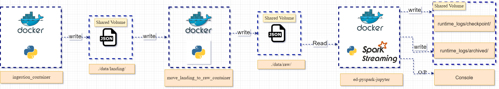
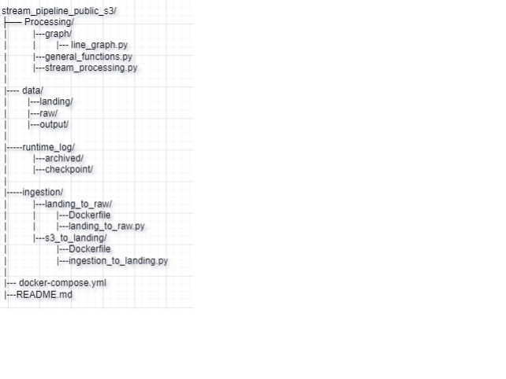

<left>
<h1>Prerequisites</h1>
<ls>
<li>Docker Version - 24.0.6</li>
</ls>
<h1>Steps to run this script</h1>

<ls>
<li>Download the Zip file or Clone this repository.</li>
<li>Go to Project Directory and open a Terminal.</li>
<li>On Terminal use command- "docker compose up". 
[Note: make sure you are in the same Directory as of docker-compose.yml file]</li>
<li>Open jupyter notebook from docker at post 8888.</li>
<li>open a Terminal and write "python stream_processing.py"</li>
</ls>

<h1> Project Architecture </h1>

<h1> Folder Architecture </h1>

<h2>[Note: Right now O/P mode is on Console, if you want to get output in files in storage. please include .option("path", "output")]

